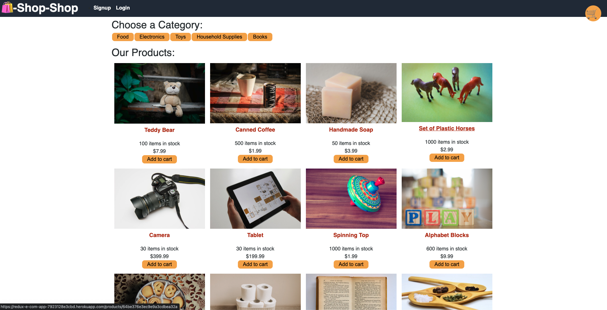
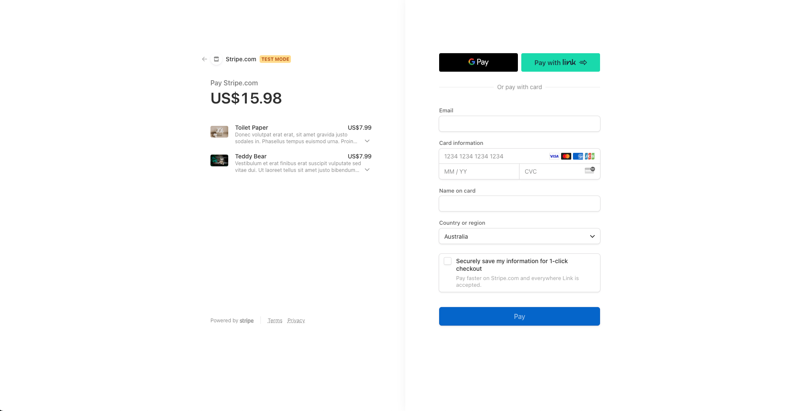

# E-commerce-Redux

## Description

Given a full functioning E-commerce application built using React Reducers and Context, I have refactored it so that it uses Redux. 

## Table of Contents

  - [Installation](#installation)
  - [Usage](#usage)
  - [Credits](#credits)

## Installation

No installation necessary. You can view the application [here](https://redux-e-com-app-7923128e3cbd.herokuapp.com/)

## Usage

When the user opens the application they will see a page full of products. 

They can click the 'Add to cart' button to add the item to their cart. If they are not signed in however, they will be unable to checkout and will be met with text saying "log in to check out" where the 'Checkout' button would be.

.png)

The user can find the log in/sign up button in the navbar. Once the user is logged in, when they click on their cart, they can click the 'Checkout' button

.png)

and will be brought to a Stripe checkout page.

## Credits

Starter code provided by Monash Bootcamp: https://git.bootcampcontent.com/Monash-University/MONU-VIRT-FSF-PT-02-2023-U-LOLC/-/tree/main/Week-22/Day-03/26-Stu_Actions-Reducers/Solved
